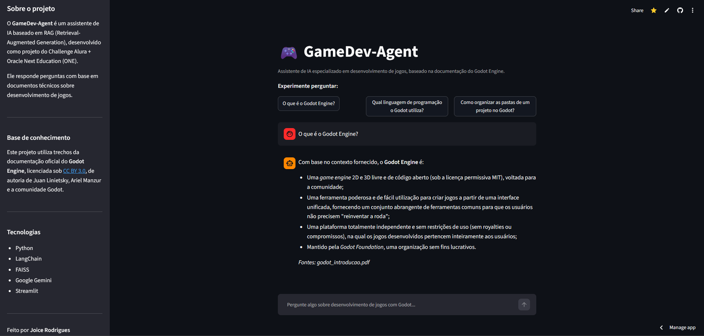

# GameDev-Agent

Assistente de IA baseado em RAG (Retrieval-Augmented Generation), capaz de responder perguntas em linguagem natural sobre desenvolvimento de jogos, com base em documentos técnicos.

Projeto desenvolvido para o Challenge Alura + Oracle Next Education (ONE).

## Sobre o projeto

O GameDev-Agent interpreta documentos técnicos sobre desenvolvimento de jogos (documentação oficial do Godot Engine) e responde perguntas em linguagem natural, utilizando Python, LangChain e o modelo de linguagem Gemini (Google), com uma interface web construída em Streamlit.

## Problema

Desenvolvedores, estudantes e profissionais da área de jogos frequentemente precisam consultar documentos técnicos extensos para encontrar informações específicas. A busca manual nesses materiais consome tempo e dificulta o acesso rápido ao conhecimento.

## Solução

O GameDev-Agent permite que o usuário faça perguntas em linguagem natural e receba respostas geradas por IA, com base exclusivamente no conteúdo dos documentos fornecidos ao sistema — sem inventar informações que não estejam na base de conhecimento.

## Objetivos

- Demonstrar, na prática, o funcionamento de um agente RAG completo.
- Aplicar conceitos de embeddings, busca vetorial e modelos de linguagem.
- Entregar uma aplicação funcional, com deploy em nuvem e acesso público.

## Arquitetura

```
Usuário
  │
  ▼
Interface Web (Streamlit)
  │
  ▼
Agente RAG
  │
  ├── Busca vetorial (FAISS) ──► Chunks relevantes dos documentos
  │
  ▼
Modelo de linguagem (Google Gemini)
  │
  ▼
Resposta em linguagem natural
```

## Fluxo da aplicação

1. Os documentos PDF são lidos e têm o texto extraído (`pypdf`).
2. O texto é dividido em pequenos trechos, os *chunks* (`langchain-text-splitters`).
3. Cada chunk é transformado em um embedding (vetor numérico) pelo modelo `gemini-embedding-001`.
4. Os embeddings são armazenados em um índice vetorial local (`FAISS`).
5. Quando o usuário faz uma pergunta, ela também é transformada em embedding.
6. O FAISS busca os chunks com embeddings mais próximos (mais relevantes) da pergunta.
7. Os chunks relevantes e a pergunta são enviados ao modelo `gemini-3.5-flash`.
8. O modelo gera uma resposta baseada apenas no contexto fornecido, também considerando as últimas trocas da conversa (memória de curto prazo) para entender perguntas de seguimento.
9. A resposta é exibida ao usuário na interface Streamlit, junto com a fonte consultada.

## Tecnologias utilizadas

- **Python** — linguagem principal do projeto.
- **LangChain** (`langchain-text-splitters`, `langchain-google-genai`) — orquestração do pipeline de RAG.
- **FAISS** (`faiss-cpu`, via `langchain-community`) — banco de dados vetorial para busca por similaridade.
- **Google Gemini** — `gemini-embedding-001` (embeddings) e `gemini-3.5-flash` (geração de respostas), ambos no tier gratuito da API.
- **Streamlit** — interface web interativa.
- **python-dotenv** — gerenciamento seguro de variáveis de ambiente.
- **Git e GitHub** — controle de versão e hospedagem do código.
- **Streamlit Community Cloud** — hospedagem da aplicação em produção (ver seção "Deploy" para detalhes sobre essa escolha).

## Estrutura do projeto

```
gamedev-agent/
│
├── data/
│   └── documentos/              # PDFs usados como base de conhecimento
│
├── src/
│   ├── document_loader.py       # Leitura dos PDFs
│   ├── vector_store.py          # Chunking, embeddings e banco vetorial (FAISS)
│   ├── reconstruir_indice.py    # Script para reconstruir o índice ao adicionar novos documentos
│   ├── rag_agent.py             # Lógica do agente RAG (busca + geração de resposta)
│   └── app.py                    # Interface Streamlit
│
├── .env.example                  # Modelo de variáveis de ambiente (sem chaves reais)
├── .gitignore
├── requirements.txt
└── README.md
```

## Como instalar

```bash
git clone https://github.com/Tedbukejojo/Tedbukejojo-gamedev-agent.git
cd Tedbukejojo-gamedev-agent
python -m venv venv
venv\Scripts\activate.bat   # Windows
pip install -r requirements.txt
```

## Configuração das variáveis de ambiente

1. Copie o arquivo `.env.example` e renomeie a cópia para `.env`.
2. Gere uma chave de API gratuita em [Google AI Studio](https://aistudio.google.com/).
3. Preencha o arquivo `.env`:

```
GOOGLE_API_KEY=sua_chave_aqui
```

⚠️ O arquivo `.env` nunca deve ser enviado ao GitHub — ele já está protegido pelo `.gitignore`.

## Como executar

```bash
streamlit run src/app.py
```

A aplicação abrirá automaticamente no navegador, geralmente em `http://localhost:8501`.

## Como utilizar

Digite uma pergunta sobre desenvolvimento de jogos com Godot na caixa de chat, ou clique em uma das perguntas de exemplo sugeridas na tela inicial. A resposta será exibida junto com o(s) documento(s)-fonte consultado(s).

O agente possui memória de curto prazo: é possível fazer perguntas de seguimento (ex.: "e ele é tipado?", depois de perguntar sobre o GDScript) sem precisar repetir o contexto, dentro da mesma sessão de conversa.

## Exemplos de perguntas

- O que é o Godot Engine?
- Qual linguagem de programação o Godot utiliza?
- Como organizar as pastas de um projeto no Godot?
- Como resolver problemas comuns no Godot?

## Exemplos de respostas

**Pergunta:** O que é o Godot Engine?

**Resposta:** Com base no contexto fornecido, o Godot Engine é uma game engine 2D e 3D livre e de código aberto, voltada para a comunidade e distribuída sob a permissiva licença MIT. Ele é uma ferramenta poderosa e de fácil utilização que permite desenvolver qualquer tipo de jogo para qualquer plataforma, sem restrições de uso, sem compromissos e sem royalties.

*Fontes: godot_introducao.pdf*

**Pergunta:** Qual é a capital do Brasil?

**Resposta:** Não encontrei essa informação na base de conhecimento.

*(Demonstra que o agente não inventa respostas fora do escopo dos documentos.)*

**Pergunta:** O que é o GDScript?

**Resposta:** Com base no contexto fornecido, o GDScript é uma linguagem de programação de alto nível, orientada a objetos, imperativa e gradualmente tipada, construída especificamente para o Godot.

*Fontes: godot_gdscript_basico.pdf*

**Pergunta de seguimento:** E ele é tipado?

**Resposta:** Com base no contexto fornecido, sim, o GDScript é uma linguagem gradualmente tipada (gradually typed)...

*(Demonstra a memória de curto prazo: o agente entendeu que "ele" se refere ao GDScript, mencionado na pergunta anterior, sem precisar que o usuário repetisse o termo.)*

## Limitações

- A base de conhecimento atual contém 4 páginas da documentação do Godot Engine, com fins de demonstração — não cobre a documentação completa.
- O pacote `langchain-community` (usado para o FAISS) foi anunciado como "sunset" pela equipe do LangChain, e está em modo de manutenção, sem novas funcionalidades.
- O tier gratuito da API do Gemini possui limite de requisições por minuto; a geração do banco vetorial é feita em lotes pequenos, com pausas entre eles, para respeitar esse limite.
- O agente possui memória apenas de curto prazo (últimos 3 turnos da conversa, mantida somente durante a sessão ativa no navegador) — não há memória persistente entre sessões diferentes.

## Deploy

O plano original do projeto previa o deploy na Oracle Cloud Infrastructure (OCI), conforme exigido pelo Challenge. Uma Compute Instance (VM.Standard.A1.Flex, Ampere/ARM, tier Always Free) foi criada com sucesso na OCI, porém o acesso via SSH à instância apresentou um erro persistente de conexão recusada (`Connection refused` na porta 22), mesmo após a configuração correta da Lista de Segurança (Security List) liberando a porta 22. Não foi possível diagnosticar e corrigir a causa raiz (possivelmente relacionada à inicialização do serviço SSH na instância) dentro do prazo do Challenge.

Diante disso, optou-se por um deploy alternativo, utilizando a **Streamlit Community Cloud** — uma plataforma gratuita, oficial do Streamlit, voltada especificamente para hospedar aplicações como esta, com deploy direto a partir do repositório GitHub.

**Aplicação publicada em:**
[https://tedbukejojo-gamedev-agent-joicegenerich.streamlit.app/](https://tedbukejojo-gamedev-agent-joicegenerich.streamlit.app/)

## Evidências do funcionamento

A aplicação está publicamente acessível e funcional no link acima. Abaixo, uma captura de tela demonstrando o agente respondendo a uma pergunta sobre desenvolvimento de jogos com Godot:



## Conclusão

Este projeto demonstrou, na prática, a construção de um agente de IA baseado em RAG: desde a leitura e divisão de documentos, passando pela geração de embeddings e armazenamento vetorial, até a integração com um modelo de linguagem para gerar respostas contextualizadas. O desenvolvimento também envolveu boas práticas de versionamento com Git, segurança no gerenciamento de chaves de API, e a construção de uma interface funcional com Streamlit.

---

Feito por **Joice Rodrigues** (Tedbukejojo)
[LinkedIn](https://www.linkedin.com/in/joicegenerich/)